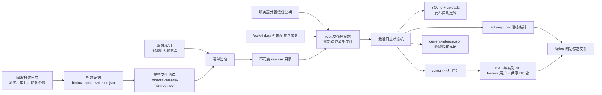

# Birdora 网站生产发布架构与维护手册

> 状态：受管发布架构已在仓库中实现到代码与本地契约测试阶段；旧环境 evidence/adoption 能力仍在开发，二者都**尚未完成目标 Ubuntu 服务器上的同构部署、系统调用审计、锁语义与故障注入演练**。在本文“上线门禁”全部满足前，不得把任一流程用于正在承载真实数据的生产服务器。

## 1. 文档范围与不可妥协原则

Birdora 是一个网站项目，浏览器前端由 Nginx 提供，Node.js API 只监听本机 `127.0.0.1:3003`，SQLite 与上传文件位于发布目录之外。本文不适用于微信小程序，也不把小程序云开发、`wx.*` 或小程序发布流程作为依赖。

生产环境已经有真实用户数据，因此所有维护和二次开发必须遵守以下原则：

1. **线上数据不可被发布包覆盖。** 数据库、上传文件、密钥、PM2 状态和激活控制文件都不进入代码发布目录；不得用空库、测试库或仓库样例覆盖生产路径。
2. **不做原地热改。** 每个候选版本是一个独立、只读、签名后的物理目录；不得在正在运行的目录中执行 `git pull`、`pnpm install`、构建、测试、递归 `chown/chmod` 或手工改代码。
3. **数据库迁移默认关闭。** 常规 API 启动固定使用 `DATABASE_AUTO_MIGRATE=false`。生产迁移只能在维护窗口、排他数据库锁和匹配的激活日志授权下显式执行。
4. **迁移开始后只允许 forward fix。** 一旦迁移可能修改了数据库，旧代码不能自动重启，也不能仅通过把运行指针切回旧版本完成“回滚”。恢复方向是修正候选代码或追加兼容迁移，使新数据库状态继续向前可用。
5. **任何身份不一致都失败关闭。** 签名、版本、物理目录、PM2 进程、数据库 inode、运行指针、激活日志和当前版本标记必须相互一致；无法证明时保持维护页或只读状态。
6. **发布控制面与应用运行面分离。** root 控制发布、签名验证、状态文件与恢复材料；`birdora` 用户只运行 API 并写业务数据，不能改发布状态。
7. **本地测试不等于生产验证。** Windows 上的单元/契约测试不能证明 Ubuntu 的 `/proc/locks`、`flock`、文件权限、ACL、capability、PM2、Nginx 和断电持久化行为。

## 2. 架构总览

该方案是“不可变 A/B 目录 + 原子指针”的发布架构，但不是两个 API 同时写 SQLite 的双活蓝绿架构。切换期间旧写入进程先停止，发布控制器取得数据库排他锁；新 API 启动后长期持有共享锁。



核心信任关系如下：

- 签名私钥只存在于离线或受控签名环境；生产服务器只有验证公钥。
- 候选包在签名前必须生成绑定 Git commit、锁文件和测试结果的构建证据。
- 签名覆盖完整文件清单，生产验证器重新扫描并比较文件路径、大小、权限位与 SHA-256；多余文件、缺失文件或内容变化都失败。
- 生产配置由严格解析器读取，不能 `source`，不能执行 shell 语法，也不能继承 `BASH_ENV`、`NODE_OPTIONS`、`LD_PRELOAD` 等环境注入入口。
- launcher、环境解析、签名验证、rollback bundle 与指针 helper 固定安装在 `/usr/local/libexec/birdora`。控制器还会执行候选包中**已经通过签名复验**的数据库/激活/静态构建脚本，因此签名审批也等同于批准这些脚本获得发布期 root 权限，必须按特权代码审查。
- 应用进程不能创建、删除或修改激活日志和当前版本标记，只能读取它们决定是否允许写请求。
- candidate 的 package.json、签名 manifest、外置 launcher 和 controller 目前必须共同声明部署控制协议 `1`；任何不一致在 maintenance 前失败。该握手只防止已知协议不兼容，尚不能证明 `/usr/local/libexec/birdora` 的多个 sibling 是一次原子安装的同一 bundle。

## 3. 生产目录、所有者与权限契约

下表是当前控制器依赖的目录契约。首次布置应由独立、审核过的初始化步骤完成；日常发布只能校验，不应递归修复线上权限。

| 路径 | 建议/强制身份 | 用途与约束 |
| --- | --- | --- |
| `/var/www/birdora-web` | root 拥有且组/其他用户不可写 | 网站应用根目录；必须是真实目录，不得经过符号链接路径组件 |
| `/var/www/birdora-web/releases` | root 拥有且组/其他用户不可写 | 后端不可变版本根；候选必须是其直接物理子目录 |
| `/var/www/birdora-web/releases/<40位commit>-<manifest前16位>` | 全树 root 拥有、组/其他用户不可写，`birdora` 可读/可遍历 | 已签名的完整后端与物化后的生产依赖；禁止符号链接、硬链接、特殊文件、setuid/setgid/sticky、扩展 ACL 和 Linux capabilities |
| `/var/www/birdora-web/current` | root 控制的符号链接 | 当前运行版本指针，只能在部署排他锁下以临时链接 + rename + 目录 fsync 原子替换 |
| `/var/www/birdora-web/.public-releases` | `root:www-data`，`0755` | 不可变静态网站版本根；当前构建会把目录设为 `0755`、文件设为 `0644` |
| `/var/www/birdora-web/.active-public` | root 控制的符号链接 | Nginx 当前静态版本指针；与运行指针分别切换、分别校验 |
| `/var/lib/birdora` | `birdora:birdora`，严格 `0700` | 运行时可写数据根；不得用发布动作递归改所有者 |
| `/var/lib/birdora/birdora.sqlite` | `birdora` 业务数据 | 唯一生产 SQLite；发布前后校验路径、存在性、非空状态、device/inode、完整性和表计数 |
| `/var/lib/birdora/uploads/community` | 位于数据根内，由 `birdora` 写 | 社区上传文件；不得符号链接到未审核的外部文件系统 |
| `/var/lib/birdora/uploads/observations` | 位于数据根内，由 `birdora` 写 | 观测上传文件；规则同上 |
| `/var/lib/birdora/pm2` | `root:root`，严格 `0700` | Birdora 专用 `PM2_HOME`；不得混入其他 PM2 应用 |
| `/var/lib/birdora-protected` | `root:root`，严格 `0700` | root-only 恢复区，应用进程不可访问或修改 |
| `/var/lib/birdora-protected/backups` | 位于恢复区 | SQLite 备份及校验清单 |
| `/var/lib/birdora-protected/rollback-bundles` | 位于恢复区，bundle `0700` | 数据库快照、迁移输出、媒体快照、旧标记和签名证据；它是恢复材料，不是自动降级授权 |
| `/var/lib/birdora-control` | `root:birdora`，严格 `2750` | 激活控制目录；应用可读但不可写 |
| `/var/lib/birdora-control/activation-pending.json` | `root:birdora`，严格 `0640`，普通单链接文件 | 持久激活日志；存在时所有业务写请求返回 `503 ACTIVATION_PENDING_READ_ONLY` |
| `/var/lib/birdora-control/current-release.json` | `root:birdora`，严格 `0640`，普通单链接文件 | 已验证当前版本的最终授权标记 |
| `/var/lib/birdora-maintenance/maintenance.flag` | root 控制 | Nginx 维护开关；数据库或激活状态不明确时必须保持启用 |
| `/var/lock/birdora-web.deploy.lock` | `root:root`，严格 `0600`，普通单链接文件 | 整个发布过程的排他 `flock`，禁止并发发布和指针竞争 |
| `/var/lock/birdora-db-maintenance.lock` | `root:birdora`，严格 `0660`，普通单链接文件 | API 共享锁与维护排他锁的共同锁文件 |
| `/etc/birdora/birdora-web-auth.env` | root，严格 `0600`，普通单链接文件 | 外置生产配置和 JWT 密钥；禁止放入 release、日志、标记或恢复包 |
| `/etc/birdora/release-signing-public.pem` | root、组/其他用户不可写、普通单链接文件 | 发布签名验证公钥 |
| `/usr/local/libexec/birdora` | root 拥有且组/其他用户不可写 | 稳定发布控制器及其受信任 helper；不得从 release 目录替代 |
| `/opt/node-v24/bin/node` | root 信任链上的物理可执行文件 | 当前生产解释器固定路径；控制器还要求 Node `>=24.14.0` |

两个业务数据路径尤其不能混淆：`/var/lib/birdora` 是应用可写的在线数据，`/var/lib/birdora-protected` 是 root-only 的恢复证据。发布包、前端同步脚本和初始化脚本都不得把文件复制到前者来“重置数据”。

## 4. 构建、签名和部署的信任边界

### 4.1 在生产服务器之外构建

候选版本必须来自一个全新的物理目录，并绑定精确的 40 位小写 Git commit。生产依赖必须完整预装且“物化”为普通文件；验证器拒绝 pnpm 常见的符号链接/硬链接布局。仓库提供 Linux-only 的 `scripts/build-release-artifact.sh`：它只接受完全干净的 committed worktree，在仓库和生产命名空间之外用 `node-linker=hoisted`、`package-import-method=copy`、`--frozen-lockfile` 安装生产依赖，重复扫描 symlink/hardlink/ACL/capability，并生成 evidence 和 manifest。该脚本本身仍须在目标同构 Ubuntu 上用真实完整构件证明，不能用 Windows 临时试验替代。

构建调用形态为 `pnpm release:build -- <已有的隔离输出根目录>`。成功结果状态是 `UNSIGNED_ARTIFACT_READY`；它不是可传输的最终包。之后必须使用获批的离线私钥签名 manifest、把 signature 设为 `0644`，再用公钥完整复验。构建脚本不会持有私钥，也不会把未签名目录标记为可上线。

构建证据由 `scripts/create-release-evidence.js` 生成，至少包含并成功执行：

- `pnpm test`
- `pnpm test:atlas`
- `pnpm audit --prod`

证据同时记录 revision、Node/pnpm 版本和 `pnpm-lock.yaml` 的 SHA-256。测试使用隔离临时数据库和上传目录，不能指向生产数据。

随后由 `scripts/create-release-manifest.js` 生成完整文件清单。清单要求包括服务器、PM2 配置、数据库迁移与维护脚本、Nginx 配置、锁文件和 `node_modules/.modules.yaml`；它拒绝 Git 元数据、`.env`、常见凭据文件、私钥材料、符号链接、硬链接和特殊文件。

### 4.2 离线签名

签名命令由 manifest 生成器提示，当前格式为对 `.birdora-release-manifest.json` 做 SHA-256 非对称签名，输出 `.birdora-release-manifest.sig`。签名私钥不得复制到仓库、构建产物或生产服务器。签名前应由签名责任人确认：

- revision 和待发布审批一致；
- 构建证据全部通过且属于同一 revision/lockfile；
- 构件目录中没有生产密钥或真实数据；
- 文件集合已冻结，签名后不再执行安装、构建、格式化或权限批量改写。

签名密钥轮换、旧公钥撤销和签名重放的操作制度目前仍需形成独立运维方案。在该方案完成前，不应把“签名可验证”误解为完整的密钥生命周期已经验证。

### 4.3 传输和生产复验

传输工具不被信任来保证内容完整性。候选目录到达服务器后必须成为：

`/var/www/birdora-web/releases/<revision>-<manifest SHA-256 前16位>`

生产验证器使用 `/etc/birdora/release-signing-public.pem` 验证签名，并重新扫描整个树；文件集合、内容、权限或模式任何一项不同都拒绝发布。控制器还拒绝 capability 和扩展 ACL。生产过程只复验预构建产物，不在服务器上执行测试、审计、依赖安装或 Git 操作。

需要特别注意：候选中的 `scripts/database-preflight.js`、`scripts/backup-database.js`、`scripts/migrate-database.js`、`scripts/update-activation-journal.js`、相关断言脚本和静态同步代码会在发布流程中由 root 控制器调用。它们受 manifest 与签名保护，但并非低权限应用代码。修改这些文件时，代码评审和签名审批必须同时检查命令执行、路径穿越、符号链接、环境变量、日志泄密及任意文件写入风险。

### 4.4 外置配置

生产启动只能通过严格 launcher 读取 `/etc/birdora/birdora-web-auth.env`。解析器只接受白名单 `KEY=VALUE`，拒绝 `export`、未知项、重复项、多行值和 NUL，并固定关键安全值，例如：

- `NODE_ENV=production`
- `HOST=127.0.0.1`、`PORT=3003`
- `NODE_INTERPRETER=/opt/node-v24/bin/node`
- `DATABASE_FILE=/var/lib/birdora/birdora.sqlite`
- `DATABASE_BACKUP_DIR=/var/lib/birdora-protected/backups`
- `DATABASE_AUTO_MIGRATE=false`
- `DATABASE_BACKUP_ENABLED=true`
- `LEGACY_JSON_IMPORT_MODE=disabled`
- HTTPS origin、secure cookie、可信代理以及默认关闭的高风险写功能

launcher 必须在清空的环境下调用。下面是架构要求的调用形态，不是“现在即可上生产”的批准命令：

```bash
env -i HOME=/root PATH=/usr/local/sbin:/usr/local/bin:/usr/sbin:/usr/bin:/sbin:/bin \
  /opt/node-v24/bin/node \
  /usr/local/libexec/birdora/run-with-production-env.js \
  /var/www/birdora-web/releases/<revision>-<manifest前16位>
```

在 Ubuntu 演练和上线审批完成前，不得执行该命令连接真实生产目录。

## 5. 数据库写入隔离与 PM2 运行模型

数据库生命周期锁使用同一个 `/var/lock/birdora-db-maintenance.lock`：

- 正常 API 由 PM2 启动 `/usr/bin/flock --shared --no-fork ... /opt/node-v24/bin/node <物理release>/server.js`，整个 API 生命周期持有共享 FLOCK。
- 备份、迁移和发布后数据库校验在旧进程停止后，由控制器持有排他 FLOCK。
- 迁移脚本不仅检查排他锁 FD，还检查 `activation-pending.json` 是否精确授权相同 attempt、revision、manifest digest 和候选物理目录。
- Linux 运行时通过 `/proc/self/fdinfo`、`/proc/locks` 及 device/inode 验证真实锁，不能只靠可伪造的环境变量声明“已加锁”。
- 控制器在进入维护前、以及迁移后启动候选前，分别以真实 `birdora` uid/gid 和清空环境执行只读权限证明：release 祖先可遍历、运行文件可读、数据根与主 DB 可读写，现存 WAL/SHM/journal sidecar 也必须由运行用户拥有并可读写；第二次还要求 activation journal 为 `root:birdora 0640` 且可解析。该证明不替代目标 Ubuntu 上的真实 SQLite WAL 演练。

PM2 使用专用 `PM2_HOME=/var/lib/birdora/pm2`，只允许 `birdora-web-auth` 一个应用定义；API 是单实例 fork 模式，以 `birdora:birdora` 运行，物理 cwd 必须是候选 release，且只监听 loopback。候选通过 `process.send("ready")` 与 readiness 检查后才允许继续切换网站静态资源。

这条单进程约束也是后续开发的硬边界。路线图中的 Outbox、媒体清理或通知 worker 不能直接新增为第二个 PM2 writer。启用前必须选择“同进程内嵌并受 journal 暂停”或扩展成经过审核的已知 writer inventory；后者要求每个进程持有同一 DB shared lifecycle lock、参与 maintenance drain、pending journal 停写、PM2 dump/PID/health 验证和故障恢复。手工启动一个未登记 worker 会绕过当前安全模型。

任何“直接 `node server.js`”“从 `current` 符号链接作 cwd 启动”“在另一个 PM2_HOME 中重启”“临时开第二个写实例”的做法都会绕过锁与身份绑定，不属于生产发布流程。

## 6. 激活状态机

部署全程由 `/var/lock/birdora-web.deploy.lock` 串行化。`activation-pending.json` 的格式版本为 2，每次激活使用唯一 attempt ID，并绑定：

- 上一/候选运行目录与 `current` 指针；
- 上一/候选静态目录与 `.active-public` 指针；
- 候选 manifest SHA-256；
- rollback bundle 目录；
- 40 位 revision。

状态只能严格前进一步，历史必须是下列完整前缀；不能跳相、倒退或复用另一次 attempt：

1. `migration-about-to-start`
2. `migration-command-complete-awaiting-postflight`
3. `database-migrated-candidate-not-yet-verified`
4. `runtime-switch-about-to-start`
5. `runtime-pointer-switched`
6. `candidate-start-about-to-begin`
7. `candidate-ready`
8. `public-switch-about-to-start`
9. `public-pointer-switched`
10. `nginx-loopback-verified`
11. `maintenance-release-about-to-start`
12. `public-readonly-verified`
13. `marker-commit-about-to-start`
14. `marker-committed`

实际发布顺序为：

1. 在仍提供服务时完成只读数据库 preflight，并证明当前 PM2、runtime 指针、签名 release、当前 marker、数据库 identity 和媒体根一致。
2. 打开 Nginx 维护页并从本机验证维护响应；停止和删除旧 PM2 writer，确认 `3003` 无监听。
3. 取得数据库排他锁，再次 preflight；创建 root-only rollback bundle 和独立数据库快照并校验。
4. 持久写入第一相激活日志后，显式执行待处理迁移；再做 SQLite integrity、foreign key、版本、表和行数不变量校验。
5. 在部署锁下原子切换 `current`，记录状态；释放排他数据库锁，以持有共享锁的新 PM2 定义启动候选。
6. 验证 PID、uid/gid、物理 cwd、Node 可执行文件、唯一 loopback listener、release identity、schema 版本和 readiness。只要 pending journal 存在，候选仅提供读取，所有 POST/PUT/PATCH/DELETE 返回 503。
7. 在外部 staging 构建静态目录，冻结权限并原子切换 `.active-public`；验证 Nginx 和 loopback API。
8. 准备解除维护，验证公开 API、静态页以及“写请求仍为 503”的只读门。
9. 以 compare-and-swap 方式原子写入并 fsync `current-release.json`，其中绑定 release、attempt、PM2 PID、公共目录、数据库 device/inode、媒体根、schema 版本和表计数。
10. 日志进入 `marker-committed` 后，复验 attempt/revision，再删除并 fsync pending journal。只有此后写请求才开放。

`current-release.json` 是运行授权，而不是显示用版本号。managed release 在无 pending journal 时如果找不到精确匹配且 `activationVerified=true` 的 marker，启动和写入都应失败关闭。

## 7. Forward-fix-only 的含义

数据库迁移可能使旧代码不再理解当前 schema，因此“代码指针回退”和“数据库恢复”不能作为一个自动动作绑定执行。

一旦 `migration-about-to-start` 已写入，或无法证明迁移尚未开始：

- 不自动启动旧 PM2 进程；
- 不把 runtime 指针自动切回旧代码；
- 可以在失败处理中把静态 public 指针恢复为上一版本，但这不代表后端已回滚；
- 保持 Nginx 维护或候选只读，保留 pending journal、数据库快照和迁移输出；
- 由维护人员根据已落盘状态制作并签名 forward-fix release，或在明确停机、独立验证和负责人批准后执行专门的数据恢复方案。

rollback bundle 只提供恢复与审计材料。直接把备份数据库覆盖到在线路径、手工删除 journal、手工伪造 marker、只改符号链接或重启旧代码，都可能产生代码/数据版本错配，禁止作为常规处置。

## 8. 旧生产环境接管阻塞（legacy adoption）

当前 `install-http.sh` 明确要求生产已经具备以下托管拓扑：

- `current` 指向一个已签名的不可变 runtime release；
- `.active-public` 指向 `.public-releases` 下的受控静态版本；
- `current-release.json` 精确绑定当前签名 release、数据库和媒体根；
- 专用 PM2_HOME 中只有匹配的 `birdora-web-auth`，其 cwd 与 runtime 指针一致；
- 当前数据库身份可被只读 preflight 和 marker 同时证明。

如果线上仍是旧式 Git 工作目录、旧 PM2 用户/PM2_HOME、未签名目录、缺少 runtime/public 指针或缺少 verified marker，主更新器会在维护与迁移之前失败。这是安全阻塞，不是应当删除的“兼容性问题”。

首次接管必须另行编写、审查并在生产副本上演练 legacy-adoption runbook。该流程至少要做到：冻结并识别当前源码、构建并签名等价基线 release、核对真实 DB 与媒体根、建立专用 PM2 拓扑、初始化两个指针和 formatVersion 2 marker，并证明全过程不迁移、不覆盖、不清空线上数据。**当前仓库没有可宣称已验证的 legacy adoption 生产流程；完成前不能用主更新器升级现有旧服务器。**

不得通过临时放宽检查、手工造 marker、把旧目录直接链接进 `releases` 或把生产 `.env` 复制进 release 来绕过该阻塞。

### 8.1 只读证据阶段不是接管阶段

legacy adoption 必须至少分成四个互不替代的阶段：

1. **live discovery：** 在网站继续运行时收集脱敏物理元数据，只用于识别拓扑和未知项。即使所有自动检查通过，最高状态也只能是 `DISCOVERY_COMPLETE_REQUIRES_QUIESCED_RECAPTURE`。
2. **quiesced binding recapture：** 未来在单独批准的维护窗口、所有已知 writer 已由独立执行流程停止后重采关键身份。只读采集器本身没有停服能力，不能把“希望 writer 已停止”当成证据。
3. **offline review/rehearsal：** 独立校验器验证证据形状、脱敏、一致性、阻塞项和固定 `PENDING` 人工目录；确认人另行签署绑定原报告 digest 的独立文件。evaluator 不合并确认、不改变报告，也永不授权。在同构 Ubuntu 与脱敏数据上另行验证零迁移等价基线和所有失败分支。
4. **P0 adoption execution：** 只有另行编写、逐行审查并完整演练的执行附录，才可能申请生产接管。前三个阶段的任何输出都不授权这一阶段。

所有 v1 evidence 必须永久声明 `inventoryOnly=true`、`adoptionAuthorized=false`、`mutationAuthorized=false`，离线 verdict 也必须永久声明 `authorizesAdoption=false`、`authorizesMutation=false`。采集“成功”、检查项 `PASS`、人工确认完成或报告被签名，都只能证明证据质量，不能产生生产变更权限。

生产侧 v1 采集器的安全边界是：稳定 root 控制面副本、固定 Node、清空继承环境、root-only 固定 policy、无任意路径/命令参数；仅有界读取固定普通文件、文件系统元数据和 `/proc` 投影。正式报告还要求采集进程与 PID 1 的 PID/mount/network/user namespace 全部相同，任一不匹配均失败关闭。它不得调用 shell 或任何外部命令（包括 PM2、Nginx、systemd、Git、SQLite CLI），不得建立网络连接，不得导入候选应用代码，也不得打开任何 SQLite 连接，包括 `readOnly` 连接。DB 仅记录 path/device/inode/owner/mode/nlink/size、sidecar 和现存 FD 身份，并显式声明逻辑内容未检查。

PM2 dump 和进程环境只可在内存中生成严格白名单投影；不得输出原始 bytes、secret 值、值哈希/长度或敏感命令行。媒体只输出有界聚合，不输出内容或可能包含用户信息的文件名。采集与离线判断必须是两个独立入口，避免把“报告已生成”误解释为“允许接管”。

未来采集器如获 R0 批准，唯一可写目标只能是预先创建的 root-only 固定证据目录，并以不可覆盖、单链接、固定权限、文件与父目录 fsync 的原子协议生成最终脱敏报告；不能接受 CLI 自定义输出路径。此前及除此以外，应用根、DB/sidecar、媒体、PM2_HOME、Nginx、journal、marker、指针和锁均不得被写入。

### 8.2 当前实现状态（2026-07-12）

仓库目前包含严格 Draft 2020-12 v1 evidence schema、受限 policy 示例、Linux-only `legacy-inventory.js` 入口、`legacy-inventory-lib.js`、离线 evaluator、定向测试和仅限 `/tmp` 沙箱的 Linux 语义测试入口。入口已实现 Linux/root/fixed-path/fixed-Node/精确环境白名单/no-args bootstrap；库已覆盖 policy/固定路径、有界非阻塞读取、`/proc`/TCP/FD 与 listener→DB opener 绑定、媒体 nested mount/cross-device 阻塞、PM2 持久 entry、Nginx/runtime/控制面投影、两遍一致性、原子报告、严格 evidence validator 和始终不授权变更的纯 verdict。Nginx 阻塞型磁盘投影只接受同一 direct server block 的目标域名、TLS 443 与 loopback upstream；未展开 include 以 `unexpandedIncludePresent` 保留，并由非阻塞 `nginx.unexpanded-includes` 及既有 Nginx/TLS 人工确认承接，不能视为已解析。源码 hash 只允许 policy 中经 R0 明确批准为非敏感的固定文件，示例清单默认空。完整 live/quiesced fixture 已在本地通过 schema，定向 legacy 测试和核心本地回归也已通过；Linux 语义测试代码尚未在当前 Windows 主机执行。

实验性 inventory 没有加入 `run-with-production-env.js` 的必需 sibling 列表，不能因旧服务器尚未安装 inventory 而阻断现有受管热更新。未来如获批准，应使用独立签名、原子安装和可回滚的 inventory 控制面 bundle；在此之前不能只更新主 launcher，也不能把 inventory 文件当作普通 release 内容加载。

这些结果只证明本地代码契约，不是生产验证。受信控制面 bundle 原子安装、真实 Linux syscall/文件访问/资源预算/竞态审计和目标 Ubuntu 演练仍未完成；collector 未在真实 Linux 或生产运行。当前入口/library/evaluator 不能复制到生产，也不能通过临时 Node 脚本或从候选 release 直接调用。后续必须先证明：没有外部命令和网络、没有 SQLite/业务内容访问、没有 secret 持久化、除固定最终报告外没有写入，并完成等价 Ubuntu 演练；在这些 P0 门禁之前，结论持续为 **NO-GO**。

此外还有两项当前代码明确没有解决的 P1 工程门禁。第一，JavaScript 内的环境校验发生在 Node 启动之后，不能防止继承的 `NODE_OPTIONS` 或 `LD_PRELOAD` 提前执行；必须由 root-owned、digest 绑定的外层控制器/服务管理器在不受信代码运行前建立最小固定环境并直接执行固定 Node，且通过相应注入负测。第二，`lstat`/`realpath`/末级 `O_NOFOLLOW` 仍不是目录级竞态安全解析，普通读取和目录遍历还可能更新 atime；所有生产读取和媒体遍历必须改为受信目录 FD 锚定，并使用原生 `openat2(RESOLVE_BENEATH | RESOLVE_NO_SYMLINKS | RESOLVE_NO_XDEV)` 或已独立证明语义等价的机制，同时使用 `O_NOATIME` 或已验证的 noatime 挂载语义，通过并发 symlink/rename swap 和 atime 零变化负测。现有自动 check 的 `PASS`、两遍快照或报告的非授权字段都不能替代这两项门禁。

## 9. 二次开发维护清单

### 9.1 新增或修改 API

- [ ] 明确接口是读还是写；写接口必须在全局 activation write gate 之后注册，不能另开未受门禁保护的监听器或旁路服务。
- [ ] 保持前端调用契约向后兼容，或先做兼容期；不要让静态前端切换早于 API readiness。
- [ ] 为认证、授权、对象所有权、输入类型/大小、上传 MIME/路径、CORS、cookie、rate limit 和错误码增加测试。
- [ ] 高风险新写能力使用 capability/feature flag，生产默认关闭；发布后再独立验证并逐项开启。
- [ ] 测试只使用临时数据库与临时上传目录，不读取或复制真实生产数据。
- [ ] 更新 `/api/health/ready` 所需的 schema/capability 条件，确保 readiness 不会在依赖未就绪时误报。
- [ ] 运行核心、集成、前端契约、相关业务和 release artifact 测试，并把要求写入构建证据，而不是仅在个人终端口头确认。

### 9.2 新增数据库迁移

- [ ] 只能追加新的连续编号迁移文件；已经写入 `schema_migrations` 的 migration 名称、内容和 checksum 永久不可修改。
- [ ] 优先使用 expand/contract：先增加兼容字段/索引并让新旧读取兼容，待所有运行版本稳定后再在后续迁移收缩；避免同一版本直接 DROP、重命名或重建关键表。
- [ ] 为未版本化旧库提供明确 preflight；为已迁移状态提供 validate；校验 SQLite `integrity_check`、`foreign_key_check` 和业务不变量。
- [ ] 评估迁移时长、磁盘空间、SQLite 锁时长、WAL/临时文件以及中断点；在脱敏生产副本和目标 Ubuntu 文件系统上演练。
- [ ] 保证备份是独立 inode 的完整副本并校验 SHA-256，不能用指向在线数据库的硬链接冒充快照。
- [ ] 当前发布后检查要求既有业务表行数不变，且只默认允许新增 `schema_migrations`/`data_migrations` 控制表。如果需求确实新增业务表、插入/删除业务行，必须把“允许的 schema/data delta”做成精确白名单和测试；不能删掉全局保护或改成无条件通过。
- [ ] 不从 PM2、SSH 或 cron 直接执行生产 `pnpm db:migrate`。生产迁移必须由发布控制器在排他 DB 锁和第一相 journal 授权下调用。
- [ ] 迁移失败后的方案必须是具体 forward fix；若确需数据恢复，单独评审停机、验证和恢复 runbook。

### 9.3 新增生产配置或密钥

- [ ] 在 `production-env-lib.js` 白名单中显式登记；决定它是必填、精确固定值、布尔值、正整数、URL 还是受限绝对路径，并设置上限。
- [ ] 同步示例配置、PM2 允许传递项和测试；未知键继续保持拒绝，不能改成“全部透传”。
- [ ] 密钥源只放 `/etc/birdora/birdora-web-auth.env` 或专门的 root-only secret 文件，不进入 manifest、release、日志、health、marker 或 rollback bundle。当前 PM2 启动模型会把 `JWT_SECRET` 放入进程环境，`pm2 save` 可能把它复制到 root-only 的 `PM2_HOME` dump；在目标 PM2 上确认权限、备份/日志排除与轮换行为，并由安全评审明确接受，或改成应用以低权限读取独立 secret 文件，之后才能勾选本项。
- [ ] 不使用 `source`、命令替换、shell 展开或继承宿主环境；继续通过 `env -i` 和 strict parser 启动。
- [ ] 配置变化如果会改变数据库、上传目录、监听地址、HTTPS origin 或身份边界，应视为架构变更，必须增加迁移/兼容与故障演练，不能当作普通变量上线。

### 9.4 新增或修改部署脚本

- [ ] 先判断脚本属于“签名 release 内的应用代码”还是 `/usr/local/libexec/birdora` 的 root 控制面；不得在两处放同名可替换实现。
- [ ] 候选包中会被 root 控制器调用的脚本必须纳入 manifest 必需文件或完整文件集、接受特权代码审查，且不得把外置 secret 输出到日志或派生文件。
- [ ] 新的控制面 helper 必须加入 launcher 的受信任 sibling 校验，固定绝对路径、root 所有且组/其他用户不可写。
- [ ] 所有 PM2、Nginx、runtime/public 指针、journal、marker、数据库和恢复区写操作必须持有相应锁；不得创建旁路脚本绕过主状态机。
- [ ] 控制文件用 `O_NOFOLLOW`、普通单链接、大小上限、所有者/权限校验；更新使用临时文件、fsync、compare-and-swap、rename、父目录 fsync。
- [ ] 指针切换必须校验 expected-old、new target 为受控根的直接物理子目录、同文件系统且非嵌套挂载；切换后重新读取真实状态。
- [ ] 不使用候选目录的 `.env`，不在生产执行 Git/build/install/test，不递归改 live data/release 权限，不捕获私钥或 JWT。
- [ ] 为每个可能中断点增加可重入/失败关闭测试和 Ubuntu 故障注入；静态字符串 lint 只能作为补充，不能替代实际行为测试。
- [ ] 同步本文的状态机、目录契约、故障矩阵和运维命令；任何新相位都必须同时更新 journal 合法前缀和应用 write gate。

### 9.5 代码评审与交接

- [ ] PR 描述列出：是否改 API、schema、配置、发布控制器、权限、Nginx、PM2、数据路径或恢复策略。
- [ ] 给出“如何证明不覆盖线上数据”的证据，而不是只写“已测试”。
- [ ] 给出目标 Ubuntu 演练记录：revision、artifact manifest digest、脱敏 DB 基线、每个注入故障、观察状态和恢复步骤。
- [ ] 记录所有未验证项、上线阻塞和责任人；不得把 TODO 从文档删除来获得上线资格。
- [ ] 保留旧 release、签名证据和 rollback bundle 的保留策略；清理前确认它们不再承担审计或 forward-fix 诊断用途。

### 9.6 修改 legacy evidence 工具或契约

- [ ] 同步 evidence schema、policy、采集器、离线校验器、测试和 legacy adoption runbook；字段语义或授权边界发生不兼容变化时发布新 schema version，不静默改变既有报告含义。
- [ ] 保持生产采集与离线判断分离；任何新增检查都只能提高证据质量或阻塞，不能令代码自动批准接管、停服、迁移、修复或写入。
- [ ] 新数据源先进入显式白名单和大小/数量上限；证明不含 secret、业务内容、用户文件名或可逆标识。无法安全投影的事实保留为人工确认，不扩大原始输出。
- [ ] 人工确认使用独立、不可变且绑定原报告 digest 的记录；采集报告中的固定人工目录保持 `PENDING`，离线校验对缺失、重复、未知或 `REJECTED` 项失败关闭，不信任手工编辑后的采集 JSON。
- [ ] `collectorErrors`、check reason 与路径/进程分类只输出固定代码或严格白名单投影；禁止直接序列化异常、任意路径、环境、命令行或系统消息。任一读取条目、字节、深度、时间或报告预算超限都标记不完整并阻塞，不能静默截断后通过。
- [ ] 维持“无 shell/外部命令、无网络、无 SQLite/应用模块、无任意路径参数”静态与运行时门禁；在目标 Ubuntu 使用 syscall/文件访问审计复核，而不只依赖源码字符串扫描。
- [ ] 任何固定路径、policy 字段、PM2 dump 结构、proc 解析、报告原子写协议或脱敏规则变化，都要补充路径替换、PID 重用、并发漂移、超限输入、secret 注入和部分写入测试。
- [ ] 报告及离线 verdict 的授权字段继续固定为 false；如果产品需求试图令 evidence 自动触发接管，应视为新的高风险控制面设计，停止修改并重新做安全/运维架构评审。

## 10. 故障恢复矩阵

以下处置均以“先阻止写入、再确认落盘事实”为优先级。`journal.status`、两个指针的实际解析目标、PM2 PID/cwd、端口监听、DB device/inode/schema、marker SHA-256 和 rollback bundle 是判断依据，不能根据终端最后一行输出猜测。

| 故障/观察 | 自动安全行为或预期状态 | 人工处置 | 禁止操作 |
| --- | --- | --- | --- |
| 发布锁已被占用 | 新发布失败，未进入并发激活 | 确认持锁 PID、进程状态和 journal；只有证明原进程结束后再重试 | 删除锁文件后并发运行 |
| 签名、manifest、文件权限、ACL/capability 或目录名不匹配 | 候选在维护/迁移前被拒绝 | 丢弃候选，从干净构建目录重新生成证据、manifest 和签名 | 在服务器上改文件后“重新试”或跳过验证 |
| 发现现存 pending journal | 控制器恢复维护并拒绝新 attempt | 根据 journal 相位核对 DB、PM2、两个指针、marker 和 bundle，形成书面恢复决定 | 直接删除 journal 或伪造下一相位 |
| 旧 PM2/指针/marker/数据库 identity 不一致 | 在迁移前失败关闭 | 先完成 legacy adoption 或修复拓扑证据；保持原业务不被发布器修改 | 放宽 identity 检查、手工链接旧目录 |
| Nginx 维护页无法本机验证 | 不应停止 writer 或进入迁移；若已停止则保持 3003 外网封锁 | 修复 Nginx，确认维护响应和 loopback-only 端口 | 在无维护屏障时继续迁移 |
| 停止旧 writer 后仍有 3003 listener | 排他 DB 锁/迁移不得继续 | 找出真实 PID/服务管理器，保持防火墙与维护，停止所有写入源 | 假定 PM2 stop 等于所有 writer 已停 |
| 旧 writer 已停后、migration 调用前任一门禁失败（含无法取得 DB 排他锁） | 不备份/不迁移；当前策略仍不自动重启旧 writer，维护保持 | 查找持锁者或失败原因；由人工核对旧签名 runtime 与 DB 尚未迁移的证据后决定恢复或修正候选 | 为缩短停机直接绕过 FLOCK、journal 或恢复脚本 |
| DB preflight、inode、完整性、外键、非空或表计数失败 | 迁移/激活停止，维护保持 | 保护原 DB 与 bundle，离线调查；确认数据源后设计恢复或 forward fix | 初始化空库、复制样例库、自动修复真实 DB |
| 备份或媒体 snapshot 校验失败 | 迁移不得开始 | 修复空间/权限/快照流程并重做；保留 `.incomplete` 供调查 | 把不完整 bundle 标记为成功 |
| 迁移命令失败或迁移后校验失败 | 旧代码不重启；writer 保持停止，维护保持；journal/bundle 保留 | 读取迁移日志和真实 schema，制作向前兼容修复版本；必要时走单独批准的数据恢复 | 切回旧 runtime 后恢复流量 |
| runtime 指针 rename 返回错误或结果不明确 | 不能凭返回码推断目标 | 在部署锁下重新读取 `current` 实际目标并核对 journal；按已落盘事实继续或修复 | 重复盲切、同时手工 `ln -sfn` |
| 候选 PM2 无法 ready、PID/cwd/uid/lock/listener 不匹配 | 候选停止并从 PM2 删除；维护保持；迁移可能开始时 runtime 留在停止的候选 | 保留 DB 现状，修复/重签 forward-fix candidate，再从 journal 事实恢复 | 自动启动旧代码或开无锁临时进程 |
| PM2 删除进程后无法证明持久 dump 为空 | 控制器使用 `pm2 save --force` 并读取 root-only `dump.pm2` 验证空数组；失败时维护/端口封锁保持 | 核对专用 PM2_HOME、目标 PM2 版本和 systemd resurrect 行为，清除错误持久状态后再继续 | 相信普通 `pm2 save` 会在空列表时覆盖旧 dump |
| public 指针切换失败 | 维护保持；失败处理尝试恢复上一个 public target | 读取 `.active-public` 实际目标和 public manifest 后修复 | 认为前端回退等同后端/数据库回退 |
| 解除维护后的 API/静态/只读写门检查失败 | 维护恢复，候选停止或保持不可写，journal 保留 | 核对 Nginx、candidate health、write gate 和两个指针 | 手工放开 POST/PUT/PATCH/DELETE |
| marker 已提交但 journal 尚未删除 | 候选仍因 pending journal 只读 | 验证 journal 为同 attempt 的 `marker-committed`，marker 与 runtime/DB/public 完全匹配，再按审核流程完成清理 | 为恢复写入而直接 `rm activation-pending.json` |
| journal 意外丢失且 marker 缺失/不匹配 | managed runtime 启动或写请求失败关闭 | 从签名 release、指针、PM2、DB 与 bundle 重建事实；经评审写入正确 marker | 临时关闭 write gate |
| 生产配置文件或验证公钥权限不安全 | launcher/验证器拒绝运行 | 从可信来源恢复 root-only 文件和父目录权限，审计是否泄露；必要时轮换密钥 | 把 secret 放入 release 或命令行参数 |
| 维护页本身无法恢复且 writer 已停 | 所有已知 PM2 writer 仍应保持停止，TCP 3003 必须外网封锁 | 优先修复 Nginx/防火墙，再处理应用 | 暴露 3003 或恢复旧 writer“救急” |

恢复完成的最低标准不是“页面能打开”，而是：签名 release、PM2 物理身份、共享 DB 锁、loopback listener、runtime/public 指针、DB identity/schema、current marker 和 journal 状态形成同一个可证明的版本事实。

## 11. 上线门禁与当前未完成项

以下项目完成并留存证据之前，生产热更新结论必须是 **NO-GO**：

- [ ] 在与目标服务器一致的 Ubuntu 版本、文件系统、Node `>=24.14.0`、PM2、Nginx、util-linux `flock`、`getcap`、`getfacl` 环境中跑通完整安装流程。
- [ ] 用真实生成的 production artifact 证明 pnpm 依赖已物化且整个 release 无符号链接、硬链接、扩展 ACL、capability 和不可读条目。
- [ ] 验证 `/proc/self/fdinfo` 与 `/proc/locks` 对共享/排他 FLOCK 的 PID、device、inode 解析符合目标内核实际输出，并覆盖竞争/等待者场景。
- [ ] 使用脱敏的生产数据库与媒体副本完成：无迁移发布、包含迁移发布、候选失败、Nginx 失败、两个指针切换中断、marker 提交中断、journal 残留、磁盘不足、进程被杀和机器重启演练。
- [ ] 完成受信 Linux legacy inventory 入口、独立离线校验器、v1 schema/policy 冻结和恶意输入/竞态测试；证明所有输出永久不授权 adoption/mutation，且 live discovery 必须要求 quiesced 重采。
- [ ] 建立独立人工确认文件和签字流程，绑定不可变采集报告 digest、确认人、时间、证据引用与结论；不得回写原报告，且任何确认仍不能替代 R1/L0/L1/P0 审批。
- [ ] 在目标 Ubuntu 对 inventory 做系统调用和文件访问审计，证明没有 shell/外部命令、网络、SQLite/应用模块、secret/业务内容读取或任意落盘；唯一写入是固定 root-only 目录中不可覆盖、已 fsync 的最终脱敏报告。
- [ ] 实现并审查 Node/动态加载器之前建立最小固定环境的 root-owned 启动控制器，固定其 owner/mode/digest，并用 `NODE_OPTIONS`、`LD_PRELOAD` 注入反例证明任何继承环境都不能先于 collector 执行。
- [ ] 将 inventory 的所有路径读取/遍历改为目录 FD 锚定的 `openat2(RESOLVE_BENEATH | RESOLVE_NO_SYMLINKS | RESOLVE_NO_XDEV)` 或已证明等价机制，使用 `O_NOATIME` 或已验证的 noatime 挂载语义，并通过并发 symlink/rename swap、跨挂载、越界和 atime 零变化反例。
- [ ] 完成获批 R0/R1 盘点、legacy-adoption runbook 和独立执行附录，并证明它能把当前旧服务器接入受管拓扑，而不修改 schema、不覆盖 DB/上传文件、不泄露密钥；只读 evidence 本身不能勾选本项。
- [ ] 将媒体快照从当前“源文件哈希 + tar 可读 + 文件数/字节数”提升或验证为可从归档内容逐文件重算并与源 manifest 对账的恢复证据。
- [ ] 完成签名密钥生成、托管、轮换、撤销、审计和紧急吊销制度。
- [ ] 明确并验证 PM2 进程环境/dump 中 JWT secret 的保存、权限、备份排除和轮换策略；未接受该风险前不得把 root-only PM2_HOME 当作“密钥从未复制”。
- [ ] 在目标 PM2 版本实测 stop/save、delete/save --force、失败后重启与 systemd resurrect，证明空 inventory 不会复活旧或候选 writer，并保存脱敏的 dump 验证结果。
- [ ] 给 `/usr/local/libexec/birdora` 控制面 bundle 建立独立签名/hash、版本清单、原子 staging+rename 安装和旧版保留策略；证明 launcher/controller/helpers 不会出现部分更新。协议号握手不能替代这项证据。
- [ ] 证明 Nginx 维护页无法绕过、3003 只在 loopback 监听，且服务器防火墙与实际部署一致。
- [ ] 为每个故障演练保存命令、时间、artifact digest、journal/marker/指针/DB 状态及恢复结果，并由非实现者复核。

仓库中的静态部署契约、Windows 单元测试和 `bash -n` 只能提前发现一部分错误，不能勾选上述 Ubuntu 门禁。没有门禁证据时，应继续在隔离环境开发和演练，不连接、不重启、不迁移真实生产服务器。

## 12. 日常审计要点

每次计划发布前，维护者应能回答并提供证据：

1. 本次精确 revision 和 manifest SHA-256 是什么，谁批准了签名？
2. 构建证据是否来自隔离数据，并绑定同一 revision 和 lockfile？
3. 当前线上 runtime/public 指针、PM2 cwd、marker、DB inode 和 schema 是否一致？
4. 本次是否有迁移；迁移是否兼容、可验证，并有明确 forward-fix 方案？
5. 独立数据库与媒体恢复材料是否空间充足、可校验、可恢复？
6. 若在任何相位断电，journal、marker 和两个指针分别会是什么，写请求是否仍然关闭？
7. 本次变更是否增加了新的 API、配置、secret、控制脚本或数据路径；相应清单是否全部完成？
8. Ubuntu 同构演练的证据是否覆盖了本次新增的风险，而不是沿用旧版本结果？

只要其中一项无法证明，就不应以“先上线再观察”处理。对有真实数据的网站，失败关闭和可审计的向前修复，比未经验证的快速恢复流量更重要。
